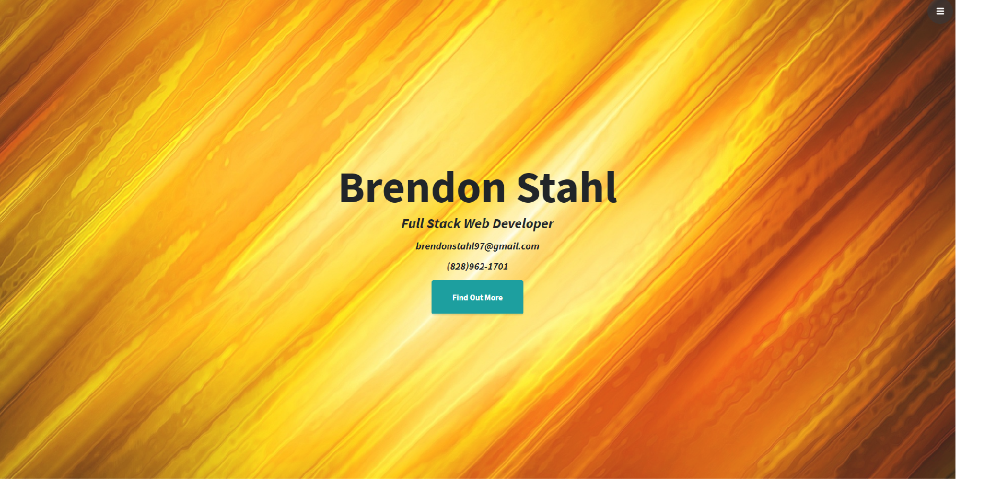
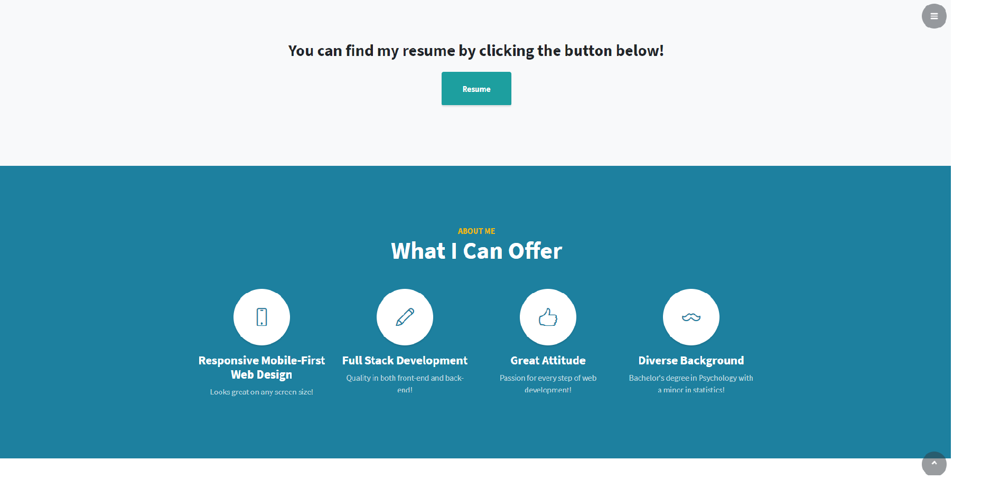
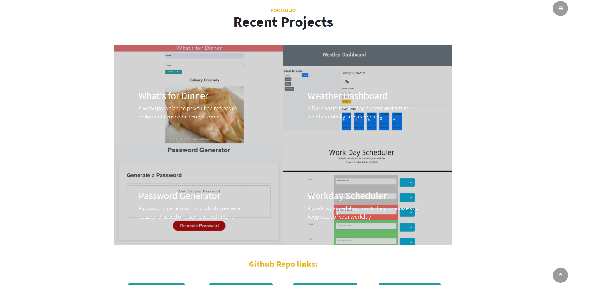

# Portfolio
Thanks for viewing my portfolio! This is an up-to-date record of my progress toward becoming a junior full stack web developer. It not only contains my contact information and resume, but links to some of my favorite projects and my social media profiles. 

## Technologies used
    * HTMl
    * CSS
    * JavaScript
    * Bootstrap
    * StartBootstrap Theme

## Example Photos

## License

Code released under the [MIT](https://github.com/StartBootstrap/startbootstrap-stylish-portfolio/blob/gh-pages/LICENSE) license.
